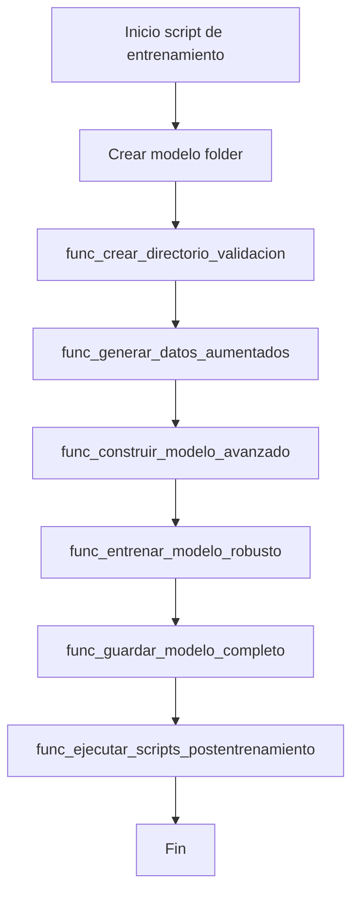
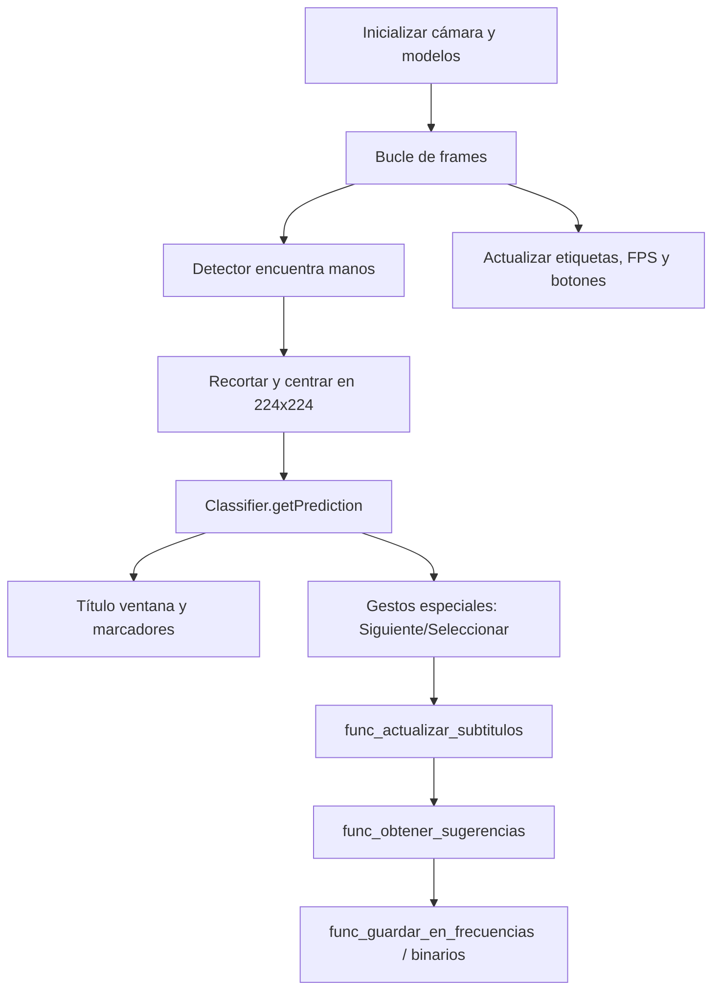
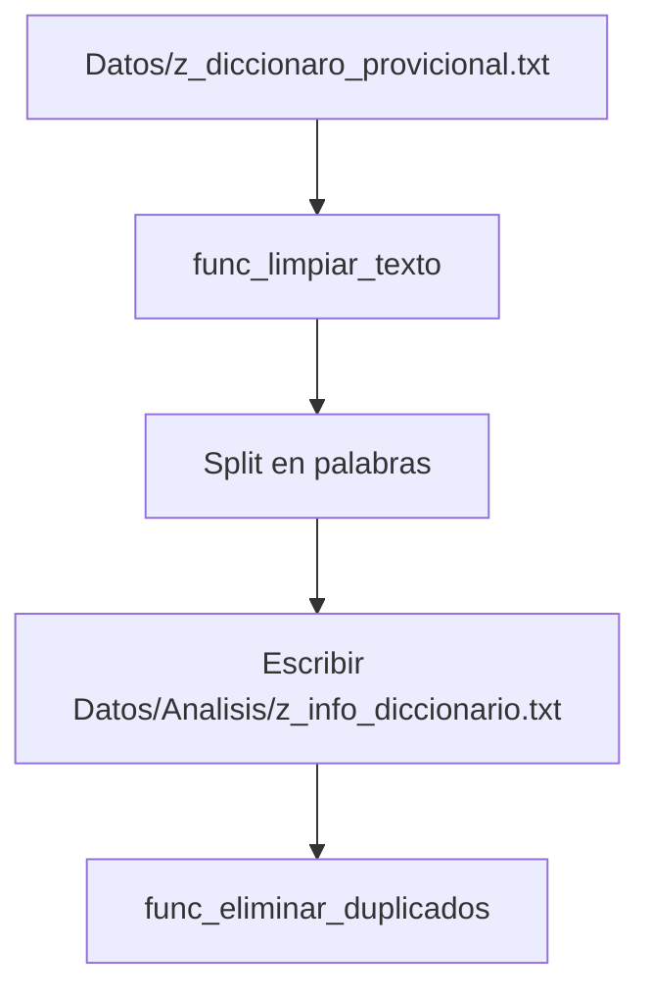
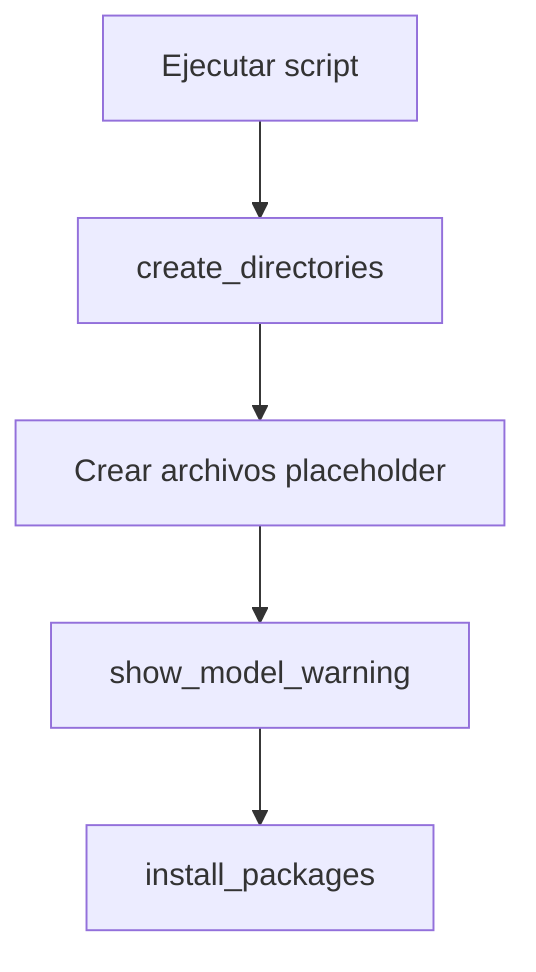
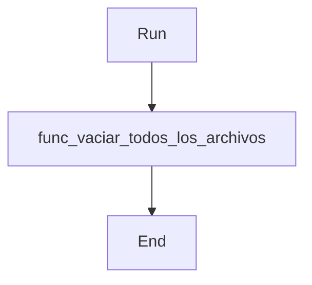
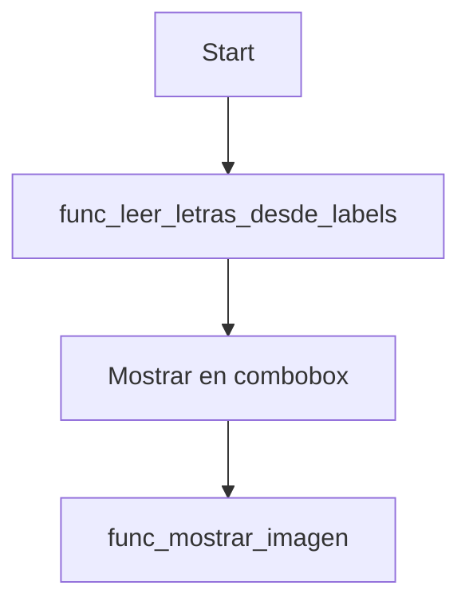

% Documentación y diagramas - Proyecto LSM

## Inicio

Proyecto LSM (Language Sign Module) — conjunto de utilidades y GUI para captura,
entrenamiento y uso en tiempo real de un clasificador de gestos/manos.

Propósito:
- Capturar imágenes de gestos para entrenamiento.
- Entrenar modelos (transfer learning con MobileNetV2).
- Ejecutar detección en tiempo real con GUI y registrar métricas.

Audiencia:
- Desarrolladores que quieran extender la recolección y entrenamiento.
- Investigadores que prueben mejoras en el modelo o en la interfaz.

---

## Temas (Índice)

1. Inicio
2. Requisitos y librerías
3. Instalación y ejecución
4. Estructura del proyecto
5. Diagramas (flujo general y por componente)
6. Tablas detalladas por archivo (variables y funciones)
7. Notas operativas y siguientes pasos

---

## Librerías y dependencias

Dependencias principales (recomendadas por `z_prcs_packages.py`):

- `opencv-python`, `opencv-contrib-python`
- `cvzone`
- `tensorflow` (o `tensorflow-macos` en Apple Silicon)
- `numpy`
- `pillow`
- `matplotlib`

Extras útiles:
- `tkinter` (incluido en la mayoría de Python distribuciones)
- `difflib` (módulo estándar)

---

## Instalación y ejecución rápida

Recomendado: crear y activar un virtualenv y luego ejecutar `z_prcs_packages.py`.

```bash
# Crear virtualenv (opcional)
python -m venv .venv
source .venv/bin/activate

# Instalar paquetes (usa z_prcs_packages.py o pip directamente)
python z_prcs_packages.py

# Para capturar datos (consola)
python z_gui_captura.py

# Para entrenamiento
python z_prcs_train.py

# Para ejecutar GUI principal
python z_gui_interfaz.py
```

Notas de plataforma:
- En macOS Apple Silicon, `tensorflow` puede requerir `tensorflow-macos`.

---

## Estructura del proyecto (resumen)

- `z_gui_interfaz.py`: Interfaz principal para detección en tiempo real.
- `z_gui_captura.py`: Captura por cámara para crear dataset.
- `z_prcs_train.py`: Pipeline de entrenamiento y guardado del modelo.
- `z_gui_graficas.py`: Visualización de métricas y análisis.
- `z_prcs_recargar_diccionario.py`: Procesamiento del diccionario fuente.
- `z_prcs_reinicio_metricos.py`: Limpieza de archivos métricos.
- `z_prcs_packages.py`: Helpers para crear carpetas y sugerir instalaciones.
- `z_gui_alph.py`: Visor de alfabeto y ejemplos.
- `tests.py`: utilidades de prueba y captura manual.

---

## Diagrama de flujo general

```mermaid
flowchart TD
    A[Captura de imágenes] --> B[Preprocesado y guardado]
    B --> C[Entrenamiento del modelo]
    C --> D[Modelo (.h5) y labels.txt]
    D --> E[Interfaz Principal (detección en tiempo real)]
    E --> F[Detección → subtítulos]
    F --> G[Sugerencias (diccionario) y validación]
    G --> H[Métricas (binarios, frecuencias, correcciones)]
    H --> I[Visualización de gráficas]
    C --> J[Archivos de info_modelos (historial)]
    subgraph Post
        K[z_prcs_reinicio_metricos.py]
        L[z_prcs_recargar_diccionario.py]
    end
    D --> K
    L --> G
```

---

## Diagramas por componente

### Captura de datos (Manual / Console)
Archivo: [z_gui_captura.py](z_gui_captura.py)

```mermaid
flowchart TD
    Start[Iniciar cámara] --> Detect[Detectar mano (cvzone)]
    Detect --> Crop[Recortar + normalizar (imgWhite)]
    Crop --> Show[Muestra en ventana]
    Show --> Input{Teclas}
    Input -->|c| Save[Guardar imagen en Datos/train/<label>]
    Input -->|n| NewDir[Crear nuevo folder]
    Input -->|d| Delete[Eliminar train/validation]
    Input -->|q| Quit[Salir]
```

### Entrenamiento (pipeline)
Archivo: [z_prcs_train.py](z_prcs_train.py)



### Interfaz principal (detección en tiempo real)
Archivo: [z_gui_interfaz.py](z_gui_interfaz.py)



### Visualización / Análisis de métricas
Archivo: [z_gui_graficas.py](z_gui_graficas.py)

```mermaid
flowchart TD
    ReadFiles[Leer z_binarios / z_frecuencias / z_correciones] --> BuildFigures
    BuildFigures --> ShowTk[Embebed en Tkinter (FigureCanvasTkAgg)]
    ShowTk --> User[Usuario refresca o cambia tab]
```

### Procesamiento de diccionario
Archivo: [z_prcs_recargar_diccionario.py](z_prcs_recargar_diccionario.py)



### Setup de proyecto y paquetes
Archivo: [z_prcs_packages.py](z_prcs_packages.py)



### Reinicio de métricas
Archivo: [z_prcs_reinicio_metricos.py](z_prcs_reinicio_metricos.py)



### Visor de alfabeto
Archivo: [z_gui_alph.py](z_gui_alph.py)



---

## Tablas por archivo

Revisadas anteriormente; ver la sección correspondiente abajo para tablas completas.

---

## Extractos de código críticos y explicación

A continuación incluyo fragmentos (capturas) de código que considero críticos o importantes, con una breve explicación de por qué importan y qué revisar si se modifica.

- `z_gui_interfaz.py` — procesamiento del frame, recorte y predicción

```python
# Recorte y centrado manteniendo el aspecto
imgCrop = img[y1:y2, x1:x2]
imgWhite = np.ones((IMG_SIZE, IMG_SIZE, 3), np.uint8) * 255
aspectRatio = h / w
if aspectRatio > 1:
    k = IMG_SIZE / h
    wCal = math.ceil(k * w)
    imgResize = func_safe_resize(imgCrop, (wCal, IMG_SIZE))
    wGap = math.ceil((IMG_SIZE - wCal) / 2)
    imgWhite[:, wGap:wCal + wGap] = imgResize
else:
    k = IMG_SIZE / w
    hCal = math.ceil(k * h)
    imgResize = func_safe_resize(imgCrop, (IMG_SIZE, hCal))
    hGap = math.ceil((IMG_SIZE - hCal) / 2)
    imgWhite[hGap:hCal + hGap, :] = imgResize

# Predicción con el clasificador
imgWhite = cv2.resize(imgWhite, (224, 224))
prediction, index = classifier.getPrediction(imgWhite, draw=False)
```

Por qué es crítico:
- Preserva la relación de aspecto para evitar distorsionar gestos.
- `func_safe_resize` protege contra crops inválidos; modificar esta lógica puede producir entradas vacías o errores en `classifier.getPrediction`.

- `z_prcs_train.py` — construcción del modelo y callbacks

```python
base_model = tf.keras.applications.MobileNetV2(
    input_shape=input_shape,
    include_top=False,
    weights='imagenet'
)
base_model.trainable = False

model = models.Sequential([
    base_model,
    layers.GlobalAveragePooling2D(),
    layers.BatchNormalization(),
    layers.Dense(512, activation='relu'),
    layers.Dropout(0.5),
    layers.Dense(num_clases, activation='softmax')
])

model.compile(optimizer=tf.keras.optimizers.Adam(learning_rate=Config.LEARNING_RATE),
              loss='categorical_crossentropy',
              metrics=['accuracy'])

# Callbacks: EarlyStopping, ReduceLROnPlateau, ModelCheckpoint
```

Por qué es crítico:
- Transfer learning: congelar `base_model` acelera y estabiliza el entrenamiento inicial.
- Callbacks previenen overfitting y guardan el mejor modelo; cambiarlos afecta cuándo se guarda `mejor_modelo_gestos.h5`.

- `z_gui_captura.py` — creación de `imgWhite` y guardado

```python
imgWhite = np.ones((imgSize, imgSize, 3), np.uint8) * 255
imgCrop = img[y - offset: y + h + offset, x - offset: x + w + offset]
# resize manteniendo aspecto (similar a interfaz)
cv2.imwrite(f'{folder}/Image_{counter:04d}.jpg', imgWhite)
```

Por qué es crítico:
- Formato de salida y nombre de archivo determinan la estructura del dataset (`Datos/train/<label>/Image_XXXX.jpg`).
- Cambiar el prefijo o extensión rompe la lectura por `ImageDataGenerator.flow_from_directory`.

- `z_prcs_recargar_diccionario.py` — limpieza de texto

```python
texto = texto.upper()
texto = unicodedata.normalize('NFD', texto).encode('ascii', 'ignore').decode('utf-8')
texto = ''.join(c for c in texto if c.isalnum() or c.isspace())
```

Por qué es crítico:
- Normaliza acentos y elimina caracteres no alfanuméricos; impactos directos en el diccionario final usado para sugerencias.

- `z_gui_graficas.py` — lectura de métricas y gráfico de pastel

```python
def func_leer_archivo_binarios(archivo="Datos/Analisis/z_binarios.txt"):
    with open(archivo, "r", encoding="utf-8") as f:
        lineas = f.read().splitlines()
    valores = [int(l) for l in lineas if l.strip() in ("0","1")]
    return valores

def func_graficar_pastel(frecuencias_counter):
    fallos = frecuencias_counter.get(0, 0)
    aciertos = frecuencias_counter.get(1, 0)
    ax.pie([fallos, aciertos], labels=["Fallos","Aciertos"], autopct="%1.1f%%")
```

Por qué es crítico:
- Esta lectura es la fuente de verdad para la métrica `accuracy` mostrada en la UI; borrar o corromper `z_binarios.txt` distorsiona los reportes.

---

Si quieres, puedo enlazar cada fragmento con el rango exacto de líneas dentro de cada archivo (añadiendo links con números de línea), o exportar estas capturas como imágenes y añadirlas al repo. ¿Qué prefieres?


- [z_gui_captura.py](z_gui_captura.py)

| Nombre | Tipo | Descripción |
|---|---|---|
| `cap`, `detector` | variables | Cámara y detector inicializados |
| `offset`, `imgSize`, `folder`, `counter` | variables | Configuración de recorte y estado de guardado |
| `func_clear_screen()` | función | Limpia consola |
| `func_create_folder(folder_name)` | función | Crea `Datos/train/<folder_name>` y cuenta imágenes |
| `func_take_capture()` | función | Guarda `imgWhite` en la carpeta actual |
| `func_delete_all()` | función | Elimina `Datos/train` y `Datos/validation` con confirmación |
| `func_show_status()` | función | Muestra estado en consola |
| `func_hand_capture()` | función | Bucle principal que detecta mano y actualiza UI/teclas |

- [z_prcs_train.py](z_prcs_train.py)

| Nombre | Tipo | Descripción |
|---|---|---|
| `GestureTrainingConfig` | class | Parámetros y rutas para entrenamiento (batch, dirs, paths) |
| `func_crear_directorio_validacion(dr_origen, dr_destino)` | función | Crea/sincroniza `Datos/validation` desde `Datos/train` |
| `func_generar_datos_aumentados(batch_size, target_size)` | función | Crea `ImageDataGenerator` para train/validation |
| `func_construir_modelo_avanzado(num_clases, input_shape)` | función | Construye y compila MobileNetV2 + cabeza personalizada |
| `func_entrenar_modelo_robusto(model, train_generator, validation_generator, epochs)` | función | Entrena con callbacks (EarlyStopping, ReduceLROnPlateau, ModelCheckpoint) |
| `func_plot_training_history(history)` | función | Genera y guarda `training_history.png` |
| `func_guardar_modelo_completo(model, class_indices, modelo_path, labels_path)` | función | Guarda el modelo y escribe `labels.txt` legible |
| `func_ejecutar_scripts_postentrenamiento()` | función | Ejecuta `z_prcs_reinicio_metricos.py` y `z_prcs_recargar_diccionario.py` |

- [z_gui_graficas.py](z_gui_graficas.py)

| Nombre | Tipo | Descripción |
|---|---|---|
| `func_leer_archivo_binarios(archivo)` | función | Lee `z_binarios.txt` y devuelve lista de 0/1 |
| `func_leer_archivo_frecuencias(archivo)` | función | Lee `z_frecuencias.txt` y devuelve Counter |
| `func_leer_archivo_correcciones(archivo)` | función | Lee `z_correciones.txt` y devuelve pares (orig, corr) |
| `func_graficar_pastel(frecuencias_counter)` | función | Genera figura de pastel aciertos/fallos |
| `func_graficar_frecuencias(frecuencias)` | función | Barra de frecuencias por etiqueta |
| `func_graficar_evolucion_accuracy(lista_binarios)` | función | Línea de evolución de accuracy acumulada |
| `func_comparar_palabras_con_porcentaje(original, corregida)` | función | Calcula diferencias y porcentaje de error |
| `func_graficar_comparacion_palabras(pares_palabras)` | función | Barra coloreada por diferencia entre palabras |
| `func_graficar_histograma_longitudes(pares_palabras)` | función | Histograma de longitudes originales vs corregidas |
| `func_embebed_figure(frame, fig)` | función | Inserta figura Matplotlib en Tkinter |
| `InterfazGraficas` | clase | UI Tkinter que embebe las figuras y gestiona tabs |

- [z_prcs_recargar_diccionario.py](z_prcs_recargar_diccionario.py)

| Nombre | Tipo | Descripción |
|---|---|---|
| `func_limpiar_texto(texto)` | función | Normaliza, elimina acentos y chars no alfanuméricos |
| `func_mostrar_alerta(mensaje)` | función | Mensaje por consola (reemplaza UI) |
| `func_procesar_archivo(archivo_entrada, archivo_salida)` | función | Limpia texto y escribe lista de palabras |
| `func_eliminar_duplicados(archivo)` | función | Elimina duplicados y ordena alfabéticamente |

- [z_prcs_packages.py](z_prcs_packages.py)

| Nombre | Tipo | Descripción |
|---|---|---|
| `DIRS_TO_CREATE`, `FILES_TO_TOUCH` | variables | Rutas que se crearán/tocarán para setup |
| `REQUIRED_PACKAGES` | variable | Lista de dependencias pip sugeridas |
| `create_directories()` | función | Crea carpetas necesarias |
| `touch_files()` | función | Crea archivos placeholder en `Datos/Analisis` |
| `show_model_warning()` | función | Indica ausencia de `mejor_modelo_gestos.h5` o `labels.txt` |
| `install_packages()` | función | Ejecuta pip install para `REQUIRED_PACKAGES` |

- [z_prcs_reinicio_metricos.py](z_prcs_reinicio_metricos.py)

| Nombre | Tipo | Descripción |
|---|---|---|
| `func_vaciar_archivo(nombre_archivo)` | función | Vacía un archivo dentro de `Datos/Analisis` |
| `func_vaciar_todos_los_archivos()` | función | Vacía la lista de archivos métricos |
| `func_ejecutar_vaciado()` | función | Orquestador para vaciar todos los archivos |

- [z_gui_alph.py](z_gui_alph.py)

| Nombre | Tipo | Descripción |
|---|---|---|
| `func_leer_letras_desde_labels(archivo)` | función | Extrae nombres de clase desde `Modelo/labels.txt` |
| `func_mostrar_letras_en_combobox()` | función | Carga combobox con letras disponibles |
| `func_mostrar_imagen(letra)` | función | Muestra `Image_0.jpg` de `Datos/train/<letra>` |
| `func_crear_boton(...)` | función | Helper para crear botones estilizados |

- [tests.py](tests.py)

| Nombre | Tipo | Descripción |
|---|---|---|
| `func_detectar_camaras()` | función | Escanea índices de cámara y devuelve disponibles |
| `func_seleccionar_camara()` | función | UI simple para seleccionar índice de cámara |
| `func_create_folder()` | función | Wrapper UI para crear carpeta de dataset (test) |
| `func_take_capture()` | función | Guarda imagen usando lógica similar a `z_gui_captura` |
| `func_delete_all()` | función | Elimina carpetas de datos con confirmación |
| `func_hand_capture()` | función | Bucle de captura usado por tests/GUI auxiliar |

---

## Notas finales y siguientes pasos

- Para actualizar la documentación con líneas específicas de funciones, indícame qué archivos quieres que enlace con líneas precisas.
- ¿Quieres que guarde este archivo, lo abra en el editor o que genere diagramas en archivos separados (SVG/PNG)?
